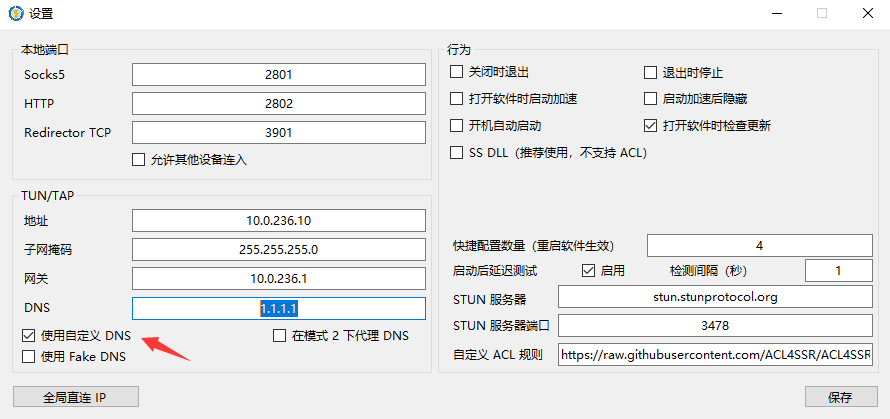

# 常见问题

## 开启 TUN/TAP 模式后 CPU 占用高

这是因为 Netch 批量向路由表写入路由规则的原因，过一会就好了

## 关于如何让 UWP 软件走系统代理

https://kiritox.me/archives/setup-proxy-for-windows-apps.html

## Windows 7 不能正常启动

是因为您的 Windows 7 不是最新的，缺少一个 KB4503292 补丁

- [Download KB4503292 MSU for Windows 7 64-bit (x64)](http://download.windowsupdate.com/d/msdownload/update/software/secu/2019/06/windows6.1-kb4503292-x64_a35bb4ea16d1d529fde9abfe8a0c16e9061f74cd.msu)

## 关于 NAT 测试

[网络地址转换-WIKIPEDIA](https://zh.wikipedia.org/wiki/%E7%BD%91%E7%BB%9C%E5%9C%B0%E5%9D%80%E8%BD%AC%E6%8D%A2)

[NAT 类型概述以及提升 NAT 类型的方法](https://www.jianshu.com/p/478a4acc9d74)

!> NAT 开放程度会影响到以 GTAOL 为代表的 P2P 连接游戏匹配玩家的数量 和 种子下载寻找其他 peer 的效果

!> NAT 测试结果只能代表 UDP 转发效果，大部分在线竞技游戏使用 UDP 协议传输游戏数据。NAT 测试结果不能代表网页浏览等 TCP 协议使用场景的使用效果

如出现 `UdpBlocked` 可能是因为

- 无法与服务器建立连接，这可能是因为 Netch 生成客户端配置错误或其他故障
- 服务器不支持 UDP 转发，请检查服务端配置
- 服务器无法建立与 STUN 服务器的连接，请在 Netch 设置内切换 STUN 服务器

[NatTypeTester.exe](https://github.com/HMBSbige/NatTypeTester)

NAT 测试结果：

`NAT1 → Full Cone NAT` 此类型可获得最佳游戏体验

`NAT2 → Address-Restricted Cone NAT`

`NAT3 → Port-Restricted Cone NAT`

`NAT4 → Symmetric NAT`

## V2ray 使用 TUN/TAP 模式 DNS 查询（打开网页）非常非常非常慢

解决方案：在设置中使用自定义 DNS 默认`1.1.1.1`

## TUN/TAP 启动失败

仅用于解决tun2socks日志中有CryptAcquireContext failed with error -2146893809 错误的问题

解决方案：win+R输入 `%appdata%\Microsoft\Crypto` 打开后移动RSA文件夹至C盘根目录备份以防万一，然后再重启Netch，RSA文件夹在启动成功后会自动重新创建

## Minecraft (Java) 模式启动后游戏载入地图卡在100%

应为Netch暂不支持IPv6所以会出现卡登陆导致游戏无响应的情况

解决方案：MinecraftLauncher ->版本配置->JVM参数 后面加上`-Djava.net.preferIPv4Stack=true`强制使用IPV4

## Netch 更新下载慢/失败

请启用 Netch 的`网页代理`后再更新。

## 其他

