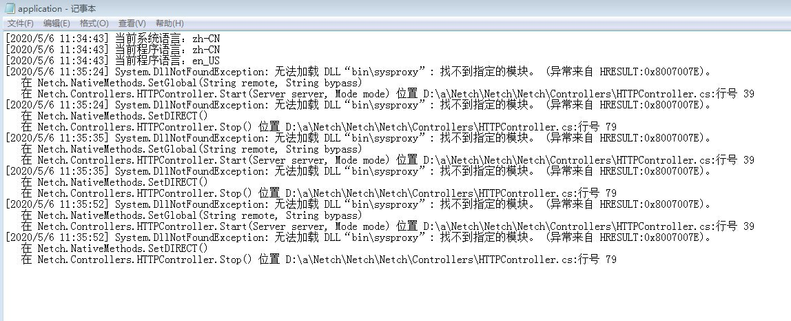

# 常见问题
## 开启 TUN/TAP 模式后 CPU 占用高

这是因为 Netch 批量向路由表写入路由规则的原因，过一会就好了

## NAT 类型测试失败
换节点

## 网页代理模式启动失败

1. 一般都是依赖没装导致的
2. 检查是否被杀软拦截

## 关于如何让 UWP 软件走系统代理
https://kiritox.me/archives/setup-proxy-for-windows-apps.html

## Windows 7 不能正常启动
是因为您的 Windows 7 不是最新的，缺少一个 KB4503292 补丁

- [Download KB4503292 MSU for Windows 7 32-bit (x86)](http://download.windowsupdate.com/d/msdownload/update/software/secu/2019/06/windows6.1-kb4503292-x86_932f3cccb6343fa2339648b391b80d28f8134870.msu)
- [Download KB4503292 MSU for Windows 7 64-bit (x64)](http://download.windowsupdate.com/d/msdownload/update/software/secu/2019/06/windows6.1-kb4503292-x64_a35bb4ea16d1d529fde9abfe8a0c16e9061f74cd.msu)

## 关于NAT测试

[网络地址转换-WIKIPEDIA](https://zh.wikipedia.org/wiki/%E7%BD%91%E7%BB%9C%E5%9C%B0%E5%9D%80%E8%BD%AC%E6%8D%A2)

[NAT类型概述以及提升NAT类型的方法](https://www.jianshu.com/p/478a4acc9d74)

如出现`UdpBlock`说明服务器不支持UDP转发即不支持游戏加速(在此也不建议使用V2ray进行游戏加速)，如果确定节点UDP没问题但是NAT测试依旧显示为`UdpBlock`时建议在设置界面更换STUN服务器。

[NatTypeTester.exe](https://github.com/HMBSbige/NatTypeTester)

STUN服务器（端口默认3478）：
- stun.miwifi.com
- stun.bige0.com
- stun.syncthing.net
- stun.stunprotocol.org Netch默认
- iphone-stun.strato-iphone.de
- stun.voipstunt.com
- stun.xten.com
- stun.schlund.de
- numb.viagenie.ca
- stun.ekiga.net
- stun.sipgate.net

4种NAT类型：

`NAT1 → Full Cone NAT` 此类型可获得最佳游戏体验

`NAT2 → Address-Restricted Cone NAT`

`NAT3 → Port-Restricted Cone NAT`

`NAT4 → Symmetric NAT` 最差

## 其他

