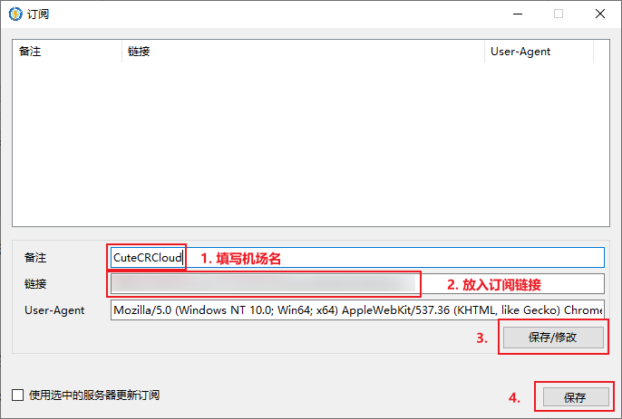
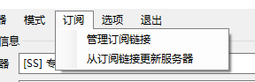

# 快速开始
[下载地址](https://github.com/NetchX/Netch/releases)

## 依赖（这个真的很重要）
- [Visual C++ 运行库合集](https://www.google.com/search?q=Visual+C%2B%2B+%E8%BF%90%E8%A1%8C%E5%BA%93%E5%90%88%E9%9B%86)
- [.NET Framework 4.8](https://dotnet.microsoft.com/download/dotnet-framework/thank-you/net48-offline-installer)
- [TAP-Windows](https://build.openvpn.net/downloads/releases/tap-windows-9.21.2.exe)

## 主界面

## 添加服务器
> Netch 目前仅支持以下代理协议：Socks5、Shadowsocks、ShadowsocksR、V2Ray

### 添加单个服务器

### 从订阅链接导入
1. 添加订阅链接

2. 回到主界面更新订阅

## 选择模式
> 你需要会一点英语，比如你应该要知道 `吃鸡` 的英文名称是 `PlayerUnknown's Battlegrounds`

选择完模式之后，点击启动，进入游戏即可

